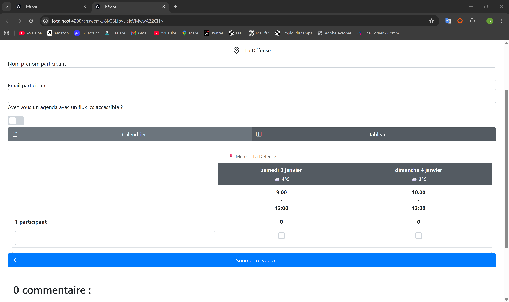
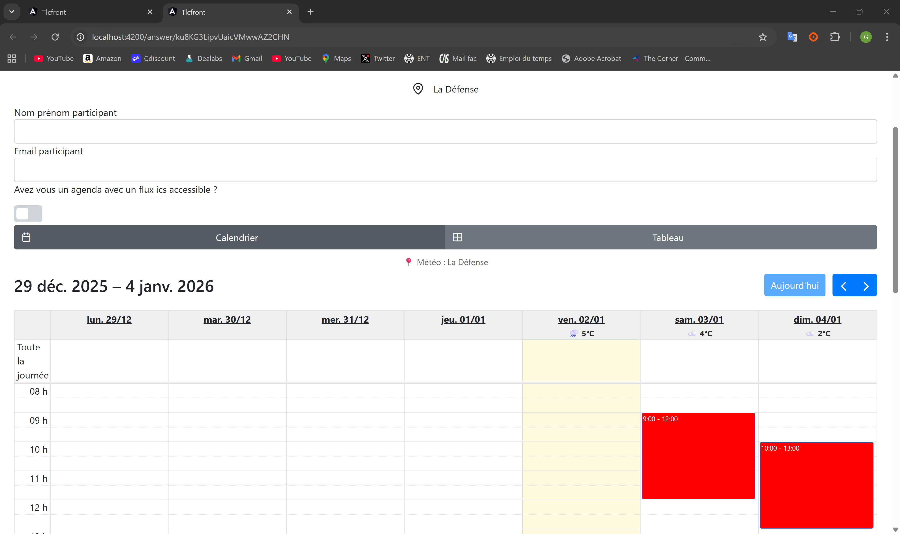
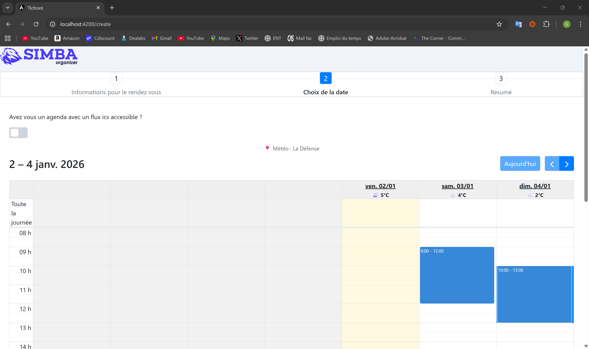

# Doodle Student - Fonctionnalité Météo

Étudiant : Gauthier COPPEAUX  
Formation : M1 2025-26 - Web Engineering  
Date : 2 janvier 2026

## Description

Extension de l'application Doodle Student existante avec ajout d'une fonctionnalité météo. L'objectif est d'afficher une prévision pour chaque date proposée dans un sondage, en tenant compte du lieu du rendez-vous.

Ce frontend a été généré avec Angular CLI (projet Angular standard), puis complété avec les composants existants de l'application.

## Aperçu

La météo s'affiche dans les écrans suivants :

- Réponse à un sondage (vue tableau)
- Réponse à un sondage (vue calendrier)
- Création d'un sondage (au moment de la sélection des dates)

Exemple d'affichage : libellé météo + température (ex : "Ciel dégagé 14°C").

## Captures d'écran

Vue réponse (tableau) : météo affichée sur chaque colonne de date.


Vue réponse (calendrier) : météo visible dans les en-têtes des jours de la semaine.


Création de sondage : météo affichée pendant la sélection des dates une fois le lieu validé.


## Fonctionnalités principales

### 1. Service météo

Fichier : `front/src/app/services/weather.service.ts`

- Récupération des prévisions via Open-Meteo (sans clé)
- Géocodage via Open-Meteo Geocoding (lieu texte → latitude/longitude)
- Prévisions sur 7 jours (limitation du service)
- Cache en mémoire pour éviter des appels répétitifs

Méthodes principales :

- `fetchWeather(location?: string)` : charge les données météo pour un lieu (Rennes par défaut)
- `getWeatherForDate(date: Date)` : renvoie la météo pour une date
- `geocodeLocation(location: string)` : convertit un nom de lieu en coordonnées
- `getCurrentLocation()` : renvoie le lieu utilisé

### 2. Affichage dans la page de réponse

Fichiers :

- `front/src/app/answer-poll/answer-poll.component.ts`
- `front/src/app/answer-poll/answer-poll.component.html`

Comportements :

- Affichage de la météo dans la vue tableau et la vue calendrier
- Mise à jour lors des changements de période du calendrier
- Prise en compte du lieu du sondage

### 3. Affichage dans la création de sondage

Fichiers :

- `front/src/app/create-poll-component/create-poll-component.component.ts`
- `front/src/app/create-poll-component/create-poll-component.component.html`

Comportements :

- Chargement de la météo dès validation du lieu
- Affichage pendant la sélection des dates

## APIs utilisées

1. Open-Meteo Forecast API

   - Endpoint : `https://api.open-meteo.com/v1/forecast`
   - Paramètres : latitude, longitude, daily (weathercode, temperature_2m_max)

2. Open-Meteo Geocoding API

   - Endpoint : `https://geocoding-api.open-meteo.com/v1/search`
   - Paramètres : name (lieu à rechercher)

## Technologies utilisées

- Angular (frontend)
- TypeScript
- PrimeNG, FullCalendar

## Installation et démarrage

### Frontend

```bash
cd front
npm install
npm start
```

Le frontend est accessible sur `http://localhost:4200/`.

### Backend

```bash
cd api
docker-compose up -d
.\mvnw.cmd quarkus:dev
```

Le backend est accessible sur `http://localhost:8080/`.

## Structure du projet

```
projetWE/
├── front/
│   ├── src/app/
│   │   ├── services/weather.service.ts
│   │   ├── answer-poll/
│   │   └── create-poll-component/
│   └── ...
├── api/
│   ├── src/
│   └── docker-compose.yaml
└── README.french.md
```

## Notes techniques

- Limitation Open-Meteo : prévisions sur 7 jours
- Lieu du sondage utilisé pour le géocodage ; repli sur Rennes si lieu vide/non reconnu
- En cas d'échec API : l'application reste utilisable (météo non affichée)

## Auteur

Gauthier COPPEAUX  
M1 IL CLA1 - Web Engineering 2025-26

## Ressources

- Open-Meteo : https://open-meteo.com/en/docs
- Doodle Student : https://github.com/barais/doodlestudent
